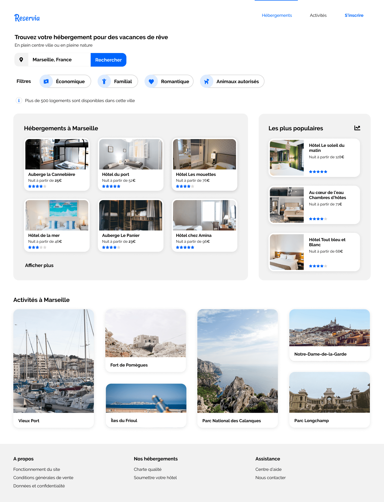

# Projet Reservia

### Description

Ce projet consiste à convertir la maquette d'une agence de location saisonnière en un site statique, conçu pour être compatible sur mobiles,tablettes et ordinateurs. Le site offrira la possibilité pour les utilisateurs de rechercher des hébergements et des activités dans la ville de leur choix.

### Documentation technique

Pour plus de détails sur les spécifications techniques et les contraintes du projet, [cliquez ici](doc/doc-p2.pdf).

### Technologies

HTML5, CSS3, Design responsive

### Installation

Clonez le dépôt et ouvrez le fichier index.html dans votre navigateur
