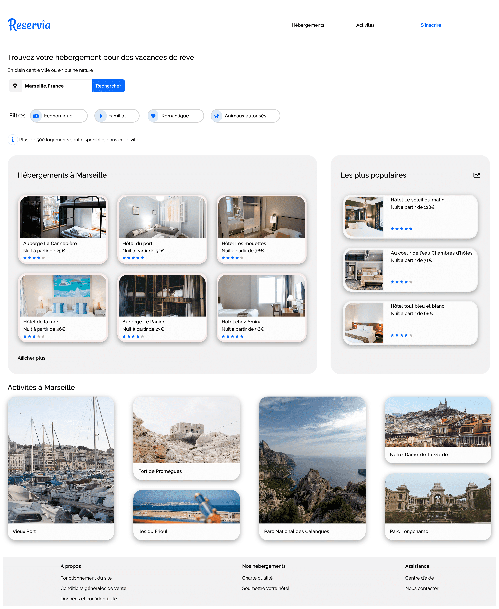

# Projet Reservia

### Description

Ce projet consiste à convertir la maquette d'une agence de location saisonnière en un site statique, conçu pour être compatible sur mobiles,tablettes et ordinateurs. Le site offrira la possibilité pour les utilisateurs de rechercher des hébergements et des activités dans la ville de leur choix.

### Fonctionnalités

- **Champ de Recherche :** Un champ permet la saisie d'une ville; la recherche est n'est pas fonctionnelle.
- **Cartes :** Cliquables, sans liens actifs.
- **Filtres :** Changent d'apparence au survol.
- **Navigation :** Ancres vers la section "Hébergements" et "Activités".

### Spécification techniques

- **Responsivité :** Breakpoints garantissant une expérience utilisateur fluide sur desktop, tablette, et mobile.
- **Images :** Optimisées en résolution et chargement
- **Police :** Police Raleway
- **Icônes et couleurs :** : Palette de couleurs bleu #0065FC, bleu clair #DEEBFF, et gris #F2F2F2. Icones de FontAwesome.
- **Langage :** HTML5, CSS3 sans framework
- **Code :** Le code doit être conforme aux standards W3C, sans erreurs. 

### Technologies

HTML5, CSS3, Design responsive

### Installation

Clonez le dépôt et ouvrez le fichier index.html dans votre navigateur
